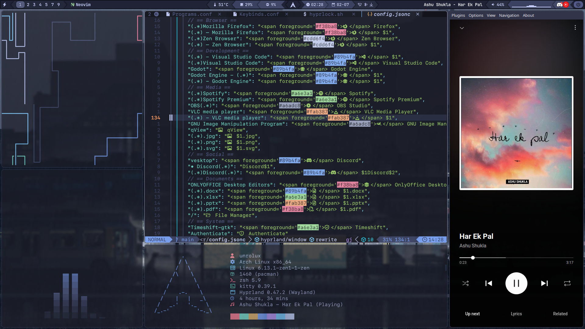

# Hyprland Dotfiles

This repository contains my personalized configuration files (dotfiles) for setting up a personalized Hyprland environment in Arch (based) distro. The configurations are managed using GNU Stow for easy symlink management.

## Screenshot(s)

## Table of Contents

- [Introduction](#introduction)
- [Features](#features)
- [Installation](#installation)
- [Usage](#usage)
- [Configuration Details](#configuration-details)
- [Customization](#customization)
- [Troubleshooting](#troubleshooting)
- [Useful Resources](#useful-resources)
- [Contributing](#contributing)
- [License](#license)

## Introduction

Dotfiles are essential for configuring and customizing your Unix-like system environment. This collection is tailored for Hyprland and includes configurations for various applications and tools to streamline the setup process.

## Features

- **Hyprland Configuration**: Custom settings for the Hyprland window manager.
- **Application Configurations**:
  - **AnyRun**: Settings for AnyRun application.
  - **Cava**: Configuration for the Cava audio visualizer.
  - **Fastfetch**: Setup for Fastfetch system information tool.
  - **Ghostty**: Config files for Ghostty.
  - **Kitty**: Terminal emulator configurations.
  - **Neovim**: Personalized Neovim editor settings.
  - **Wallust**: Wallpaper management configurations.
  - **Waybar**: Status bar configurations.
- **Shell Configuration**: Zsh shell setup.
- **Wallpapers**: A collection of wallpapers.

## NOTE

this readme file is not final.
